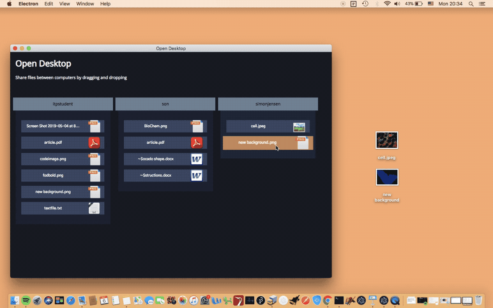

<h1> Open Desktop </h1>

<h2> Collaborative file sharing project built using socket.io, electron and socket-stream </h2>



<p>
Open Dekstop is an application that reimagines file sharing by using your desktop as a
communal environment. Clients can see files located on others clients devices
and freely move them - to take, give or distribute files among users. With
this application there is no upload or download - simply the movement of
files.
</p>

<h3> Before testing: Be aware </h3>
<p>
The application is part of an exploration, investigating the question: "Would
more creative applications in software be unleashed if we didn't start by
saddling designers and developers with privacy and security concerns?".
I wanted to see what we could do with software if we didn't care about safety. This application simplifies filesharing between computers - allowing everyone to see files on your desktop. By downloading and starting this application you are potentially running the risk of having your files stolen from your desktop or having other users send you malicious files. Another potential option is to test the repository locally - more information on that later.    
<p>

<h3> To test </h3>
<p> Clone/Download the repository and change directory into the projectfolder </p>

install the necessary node module dependencies 

```
[electronSocket]$ npm install
```

<p> to run the application type: </p>

```
[electronSocket]$ npm run client
```

<p> Doing this will connect you to my server and potentially other users. <p>

<h3> To test it locally </h3>
<p> Start a local server on port 8080 by typing </p>

```
[electronSocket]$ npm start
```

<p> Go to renderer/renderer.js and change the following</p>

```Javascript
const socket = io("http://smj470.itp.io:8080");
//NOTE: for local testing
// const socket = io("http://localhost:8080");
let arrayWithoutFolders = [];
let filesOnly = [];
//NOTE: for local testing
// const electronFileTestFolder = process.env.FOLDER;
// const testfolder = `${os.homedir}/Desktop/${electronFileTestFolder}`;
const testfolder = `${os.homedir}/Desktop/`;
let noFolders = [];
let updateDesktop;
```

<p> to the following <p>

```Javascript
//const socket = io("http://smj470.itp.io:8080");
//NOTE: for local testing
const socket = io("http://localhost:8080");
let arrayWithoutFolders = [];
let filesOnly = [];
//NOTE: for local testing
 const electronFileTestFolder = process.env.FOLDER;
 const testfolder = `${os.homedir}/Desktop/${electronFileTestFolder}`;
//const testfolder = `${os.homedir}/Desktop/`;
let noFolders = [];
let updateDesktop;
```

<p> This will redirect to your localserver and change the testfolder to the folder we are about to
create on the desktop. Make similar changes in line 67 and 99 to redirect to the right folder. </p>

<p> Create a folder on your desktop called myFolder and run the application with directions to that folder </p>

```
[electronSocket]$ Folder=myFolder npm run client
```

<p> Now you can test the filetransfer between folders by running it from several different folders fx </p>

```
[electronSocket]$ Folder=myFolder2 npm run client
```
